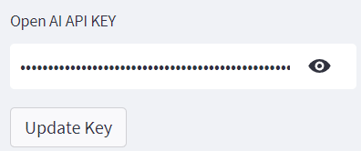

# Description  

Python Streamlit web application designed to provide a user-friendly interface for querying and using the OpenAI language model to communicate with data such as such as CSV, XLSX, or XLS
The script begins by importing the necessary libraries, including os for operating system interactions, streamlit for building web applications, pandas for data manipulation, open_ai key for loading environment variables, and langchain to for interacting with the openAI API and creating a Pandas DF agent.


#### Requirements:
* Open AI API Key:  [click here](https://platform.openai.com/account/api-keys).


#### Access Previous Conversations:

When accessing the convo_history.json file, the conversations shall be stored in the following format:

```json
    "DATE_TIME_STAMP": [
            {
                "Question": "",
                "Answer": "",
                "Steps": ""
            }
        ]
```

#### References:
* [LangChian Concept ](https://wjayesh.medium.com/how-autonomous-agents-work-the-concept-and-its-langchain-implementation-e1a77f612427)
* [LangChain Dataframe Agent](https://python.langchain.com/en/latest/modules/agents/toolkits/examples/pandas.html)
* [Open AI Model](https://platform.openai.com/)
* [StreamLit Python](https://docs.streamlit.io/)
* [Pandas AI Library](https://python.langchain.com/en/latest/modules/agents/toolkits/examples/pandas.html)

